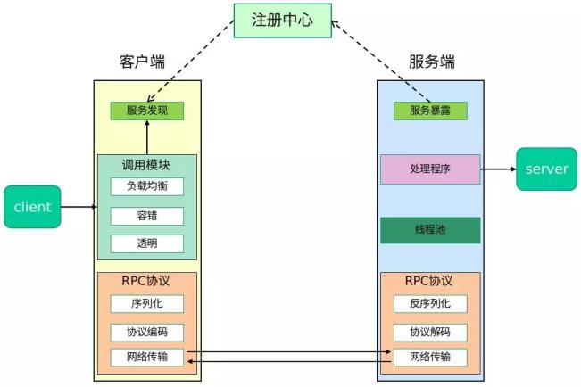

## 思路

RPC框架原理很简单，客户端和服务端都可以访问到通用的服务接口，但是只有服务端有这个服务接口的实现类，客户端调用这个接口的方式，是通过Netty网络传输，告诉服务端我要调用这个服务，
服务端收到RpcRequest请求之后呢，就找到这个服务接口的实现类，然后执行具体的服务逻辑，将执行的结果放到RpcResponse中，通过Netty网络传输返回给客户端，作为客户端调用接口方法的返回值。

但是实现值得商榷，例如客户端怎么知道服务端的地址？客户端怎么告诉服务端我要调用的接口？客户端怎么传递参数？只有接口客户端怎么生成实现类……等等等等。

## 架构




## 通用的服务接口

我们先把通用的服务接口写好，然后再来看怎么实现客户端和服务端。

接口如下：

```java
public interface HelloService {
    String hello(HelloObject object);
}
```

hello方法需要传递一个对象，HelloObject对象，定义如下：

```java

@Data
@AllArgsConstructor
public class HelloObject implements Serializable {
    private Integer id;
    private String message;
}
```

注意这个对象需要实现`Serializable`接口，因为它需要在调用过程中从客户端传递给服务端。

接着我们在服务端对这个接口进行实现，实现的方式也很简单，返回一个字符串就行：

```java
public class HelloServiceImpl implements HelloService {
    private static final Logger logger = LoggerFactory.getLogger(HelloServiceImpl.class);

    @Override
    public String hello(HelloObject object) {
        logger.info("接收到：{}", object.getMessage());
        return "这是调用的返回值，id=" + object.getId();
    }
}
```

## 传输协议

严格来说，这并不能算是协议……但也大致算一个传输格式吧。

我们来思考一下，服务端需要哪些信息，才能唯一确定服务端需要调用的接口的方法呢？

首先，就是接口的名字，和方法的名字，但是由于方法重载的缘故，我们还需要这个方法的所有参数的类型，最后，客户端调用时，还需要传递参数的实际值，那么服务端知道以上四个条件，就可以找到这个方法并且调用了。我们把这四个条件写到一个对象里，到时候传输时传输这个对象就行了。即`RpcRequest`
对象。

参数类型我是直接使用Class对象，其实用字符串也是可以的。

那么服务提供端调用完具体的服务实现类的方法后，需要给客户端返回哪些信息呢？如果调用成功的话，显然需要返回值，如果调用失败了，就需要失败的信息，这里封装成一个`RpcResponse`对象。
RpcResponse中两个静态方法，可以用来快速生成成功与失败的响应对象。其中，statusCode属性可以自行定义，客户端服务端一致即可。

## 客户端的实现——动态代理

客户端方面，由于在客户端这一侧我们并没有接口的具体实现类，就没有办法直接生成实例对象。这时，我们可以通过动态代理的方式生成实例，在调用方法时生成需要的RpcRequest对象通过NettyClient发送给服务端。

这里我们采用JDK动态代理，代理类实现了`InvocationHandler`接口。

## 服务端的实现——利用Java反射机制来完成调用

这里值得强调一下啊，服务提供侧可以注册任意多个服务到注册中心，即对外（服务消费者）提供任意多个服务。

### 在服务提供侧实现该接口

```java
package czihao.test;

import HelloService;

@Service
public class HelloServiceImpl implements HelloService {
    @Override
    public String hello(String name) {
        return "Hello, " + name;
    }
}
```

### 测试用基于Netty网络传输的服务提供者（服务端）

```java
package czihao.test;

import HelloService;
import CommonSerializer;
import NettyServer;

@ServiceScan
public class NettyTestServer {
    public static void main(String[] args) {
        NettyServer server = new NettyServer("127.0.0.1", 9999, CommonSerializer.PROTOBUF_SERIALIZER);
        server.start();
    }
}
```

### 测试用基于Netty网络传输的服务消费者（客户端）

```java
package czihao.test;

import HelloService;
import CommonSerializer;
import RpcClient;
import RpcClientProxy;
import NettyClient;

public class NettyTestClient {

    public static void main(String[] args) {
        RpcClient client = new NettyClient(CommonSerializer.HESSIAN_SERIALIZER, new RandomLoadBalancer());
        RpcClientProxy rpcClientProxy = new RpcClientProxy(client);

        HelloService helloService = rpcClientProxy.getProxy(HelloService.class);
        HelloObject object = new HelloObject(12, "This is a message");
        String res = helloService.hello(object);
        System.out.println(res);

        ByeService byeService = rpcClientProxy.getProxy(ByeService.class);
        System.out.println(byeService.bye("czihao"));
    }

}
```

### 启动

在此之前要确保 Nacos 运行在本地 `8848` 端口。

首先启动服务提供者所在的服务端，再启动服务消费者。
